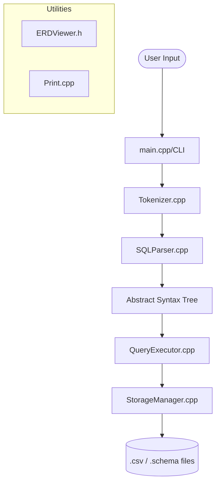

# FeatherDB Technical Overview

FeatherDB is a custom, file-based relational database management system (RDBMS) implemented in C++. It supports a subset of SQL for data definition and manipulation, with a focus on simplicity and educational utility.

## 🏗️ Architecture Overview

The system follows a classic decoupled architecture:

---

## 📂 Component Breakdown

### 1. ⌨️ CLI & Entry Point (`src/main.cpp`)
- **Main Loop**: Handles the REPL (Read-Eval-Print Loop).
- **Commands**: Supports dot-commands like `.exit`, `.help`, `.tables`, `.erd`, and `.schema <table_name>`.
- **Authentication**: Includes a "stealthy" toggle via the secret phrase `ramadanKareemAvdol`. When authenticated, users can perform mutations (CREATE, INSERT, etc.); otherwise, only `SELECT` is permitted.

### 2. 🔍 Parser (`src/parser/`)
- **Tokenizer**: Breaks raw SQL strings into logical tokens (keywords, literals, operators).
- **SQLParser**: Uses recursive descent to transform tokens into an Abstract Syntax Tree (AST).
- **AST**: Represents structured statements like `SelectStatement`, `CreateStatement`, etc.

### 3. ⚙️ Execution Engine (`src/query/`)
- **QueryExecutor**: Processes the AST.
- **Logic**: Handles the "how" of a query—verifying constraints, finding tables, and modifying data.
- **Nested Queries**: Supports execution of subqueries by returning intermediate `Table` structures.

### 4. 💾 Storage Layer (`src/storage/`)
- **StorageManager**: Manages the physical persistence of data.
- **File Format**: 
    - `.schema`: Stores metadata (column names, types, primary keys, foreign keys).
    - `.csv`: Stores the actual row data in plain text.
- **Persistence**: Efficiently handles row appending and table loading/saving.

### 5. 🛠️ Utilities (`src/utils/`)
- **ERD Viewer**: Generates a text-based Entity Relationship Diagram from stored schemas.
- **Validators**: Placeholder for future data integrity checks.
- **Print**: Handles stylized console output (intro, help, prompt).

---

## 🔄 Data Flow: A Query's Journey

1. **Input**: User types `SELECT * FROM Users;`.
2. **Tokenization**: Input is split into `[SELECT, *, FROM, Users, ;]`.
3. **Parsing**: `SQLParser` creates a `SelectStatement` object.
4. **Execution**: `QueryExecutor` calls `StorageManager::loadTable("Users")`.
5. **Output**: Resulting rows are formatted and printed to the console.

---

## 🔍 Low-Level Technical Summary

For developers looking to modify the internals:

- **Memory Management**: Uses `std::unique_ptr` for AST nodes to ensure safe cleanup.
- **Namespacing**: Core logic resides in the `spl` namespace.
- **Error Handling**: Uses a try-catch block in `main.cpp` to catch logic errors from the parser or storage layers.
- **Secret Toggle**: The variable `authenticated` in `main.cpp` acts as a gatekeeper. If `false`, any AST node that is not a `SELECT` type is rejected with a generic "Table not found" error to maintain stealth.
- **Constraint Enforcement**: Primary key and foreign key definitions are stored in `.schema` files and checked during `INSERT` or table creation in the `QueryExecutor` (or `StorageManager` updates).
- **Storage Path**: All data is stored in the `db/` relative directory. Table names are case-sensitive as they map directly to filenames.

---

