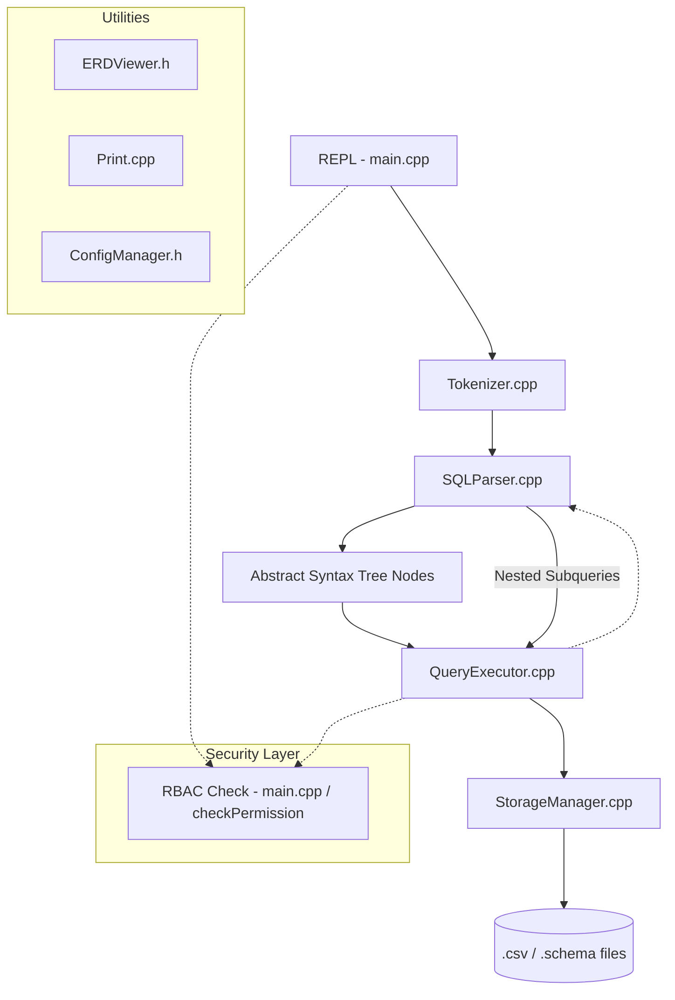

# FeatherDB Internal Documentation

FeatherDB is a file-based relational database engine implemented in C++ (version `1.2.1-FIXED-SECURITY`). 

It is designed as a pedagogical tool to demonstrate the core principles of SQL parsing, query execution, 
and relational data persistence. This documentation provides a comprehensive reference for understanding 
the internal architecture, data flow, and design decisions within the system.


---


## 1. SYSTEM OVERVIEW

This section describes the scope, goals, and intended use cases for FeatherDB.


### Scope and Goals

FeatherDB provides a functional SQL environment with support for the following features:

- Defining schemas with constraint support (`PRIMARY KEY`, `UNIQUE`, and `REFERENCES`).
- Performing standard DML operations (`SELECT`, `INSERT`, `UPDATE`, `DELETE`).
- Executing DDL commands (`CREATE TABLE`, `DROP TABLE`).
- Managing role-based access control (RBAC) via secret keys.
- Visualizing entity relationships dynamically through ERD generation.
- Supporting nested `SELECT` statements in query conditions.


### Non-Goals

FeatherDB is **not** intended for the following applications:

- High-concurrency or multi-user production environments.
- Large-scale data processing (requires entire tables to be resident in RAM).
- ACID-compliant transaction management with crash recovery logs.
- Distributed query processing or replication.

These limitations are intentional design choices to keep the codebase simple and focused on 
educational value rather than production robustness.


---


## 2. ARCHITECTURE DIAGRAM

The following diagram illustrates the unidirectional pipeline from user input through multiple 
processing stages to eventual disk storage. This represents the complete lifecycle of a single query.


### High-Level Architecture




### Architecture Explanation

The diagram shows the sequential flow of data through the system:

1. **User Input** → REPL receives raw SQL string from user terminal.
2. **Tokenization** → Tokenizer breaks string into atomic lexical units (keywords, identifiers, operators).
3. **Parsing** → SQLParser uses recursive descent to build an Abstract Syntax Tree (AST).
4. **Validation** → RBAC layer checks if current role has permission to execute the statement.
5. **Execution** → QueryExecutor traverses the AST and performs logical operations.
6. **Persistence** → StorageManager writes results to disk in CSV/Schema format.


---


## 3. COMPONENT DEEP DIVES

This section provides detailed technical information about each major component of the system, 
including responsibilities, interfaces, and integration points.


### **3.1 Tokenizer Component**

**Location**: `src/parser/Tokenizer.h/cpp`

**Primary Responsibility**: 

The Tokenizer converts raw string input into a stream of atomic tokens. It acts as the lexical analyzer 
for the system, breaking SQL statements into recognizable units that can be processed by the parser. 
Each token is classified by type (keyword, identifier, operator, etc.).


**Public Interface**:

- `std::string nextToken()` - Returns the next token in the input stream.
- `bool hasNext()` - Checks if more tokens remain to be consumed.
- `TokenType getLastTokenType()` - Returns the classification of the most recently consumed token.


**Internal State Management**:

- `position` pointer - Tracks current location in input string.
- `currentToken` - Stores the string representation of the current token.
- `currentType` - Stores the type classification of the current token.


**Token Types Supported**:

- KEYWORD - SQL language keywords (SELECT, FROM, WHERE, etc.)
- IDENTIFIER - User-defined names (table names, column names, aliases)
- NUMBER - Numeric literals (42, 3.14)
- STRING - String literals enclosed in single quotes ('hello world')
- OPERATOR - Comparison and arithmetic operators (=, <, >, +, -, etc.)
- PUNCTUATION - Delimiters and separators (comma, parenthesis, semicolon)
- END - Special token indicating end of input stream


**Modding Impact**: 

Changing delimiters or adding keywords (e.g., `JOIN`) in the Tokenizer requires corresponding 
updates in the matching logic within SQLParser to handle the new tokens properly.


---


### **3.2 SQLParser Component**

**Location**: `src/parser/SQLParser.h/cpp`

**Primary Responsibility**: 

The SQLParser validates SQL syntax and constructs an Abstract Syntax Tree (AST) representing 
the parsed statement. It uses a recursive descent parsing strategy to handle nested queries and 
complex statement structures.


**Public Interface**:

- `std::unique_ptr<AST> parse()` - Parses the input token stream and returns the resulting AST node.


**Internal State**:

- Reference to Tokenizer - For consuming tokens
- `currentToken` - String representation of token being processed
- `currentType` - Type of the current token being processed


**Recursive Descent Strategy**:

The parser implements separate parsing methods for each SQL statement type:

- `parseSelect()` - Handles SELECT statements including WHERE, ORDER BY clauses
- `parseInsert()` - Handles INSERT INTO statements with column and value lists
- `parseUpdate()` - Handles UPDATE statements with SET and WHERE clauses
- `parseDelete()` - Handles DELETE FROM statements with WHERE clauses
- `parseCreate()` - Handles CREATE TABLE statements with column definitions
- `parseDrop()` - Handles DROP TABLE statements
- `parseGrant()` - Handles GRANT statements for RBAC
- `parseCreateRole()` - Handles CREATE ROLE statements for user management


**Modding Impact**: 

Changing the grammar (e.g., making the `FROM` clause optional) breaks the SQL dialect and requires 
corresponding adjustments in `QueryExecutor` to handle the new statement structure.


---


### **3.3 Abstract Syntax Tree (AST)**

**Location**: `src/parser/AST.h/cpp`

**Primary Responsibility**: 

The AST provides a polymorphic data structure to represent parsed SQL statements in a hierarchical format. 
Each statement type has its own subclass that stores the relevant components of that statement.


**Base Class Interface**:

- `std::string type` - String identifier for the statement type (e.g., "SELECT", "INSERT")
- `virtual std::string toString()` - Converts the AST node back to readable SQL format


**Statement Subclasses**:

Different statement types inherit from the AST base class:

- `SelectStatement` - Stores: columns, table, condition (WHERE), orderBy column
- `InsertStatement` - Stores: table name, column list, value list
- `UpdateStatement` - Stores: table name, column to update, new value, condition
- `DeleteStatement` - Stores: table name, condition (WHERE)
- `CreateStatement` - Stores: table name, column definitions with types and constraints
- `DropStatement` - Stores: table name to drop
- `GrantStatement` - Stores: privilege list, table, target role
- `CreateRoleStatement` - Stores: role name, secret key


**Modding Impact**: 

Adding new fields to existing statements (e.g., `GROUP BY` column to SelectStatement) requires:

1. Adding the field to the class definition
2. Updating the Parser to extract and populate the new field
3. Updating the Executor to process the new field
4. Potentially updating toString() for SQL reconstruction


---


### **3.4 QueryExecutor Component**

**Location**: `src/query/QueryExecutor.h/cpp`

**Primary Responsibility**: 

The QueryExecutor processes AST nodes and performs the actual logical operations dictated by the statement. 
This includes filtering, sorting, validation of constraints, and integrity checking.


**Public Interface**:

- `void execute(std::unique_ptr<AST>, std::string& currentRole)` - Executes the given AST using the specified role context


**Execution Flow**:

The executor examines the AST node type and delegates to the appropriate handler:

- `handleSelect()` - Filters and sorts rows
- `handleInsert()` - Validates constraints and appends rows
- `handleUpdate()` - Locates matching rows and updates values
- `handleDelete()` - Locates matching rows and removes them
- `handleCreate()` - Creates new table schema
- `handleDrop()` - Removes table definition and data
- `handleGrant()` - Adds role permissions
- `handleCreateRole()` - Creates new database role


**Internal Operations**:

Key operations performed during execution:

- **Constraint Validation** - Checks PRIMARY KEY, UNIQUE, and FOREIGN KEY constraints
- **Permission Checking** - Verifies current role has required privileges
- **Condition Evaluation** - Parses and evaluates WHERE clause expressions
- **Type Checking** - Validates data types match column definitions
- **Referential Integrity** - Enforces foreign key relationships


**Modding Impact**: 

Modifying conditions evaluation in `evaluateSimple()` directly affects behavior of 
`WHERE` clauses in SELECT, UPDATE, and DELETE statements.


---


### **3.5 StorageManager Component**

**Location**: `src/storage/StorageManager.h/cpp`

**Primary Responsibility**: 

The StorageManager handles all physical I/O operations for the system. This includes loading and saving 
table schemas, managing data rows, and storing RBAC metadata. All operations are static methods that 
directly interact with the file system.


**Public Interface**:

- `static bool createTable(name, columns)` - Creates new table schema
- `static Table loadTable(name)` - Loads table schema and data from disk
- `static bool saveTable(table)` - Writes modified table back to disk
- `static bool appendRow(table, row)` - Appends new row to table
- `static bool dropTable(name)` - Removes table completely
- `static std::vector<std::string> listTables()` - Lists all available tables
- `static bool checkPermission(role, action, table)` - Checks RBAC permissions
- `static bool roleExists(name)` - Checks if role exists


**File System Organization**:

- `db/` directory - Root storage directory
- `db/<tablename>.csv` - Data file with pipe-separated values
- `db/<tablename>.schema` - Schema file with column definitions
- `db/_roles.csv` - RBAC role metadata
- `db/_permissions.csv` - RBAC permission mappings
- `db/_erd.txt` - Cached entity relationship information


**Modding Impact**: 

Changing the CSV format to JSON or another format requires a complete rewrite of 
`loadTable()` and `saveTable()` functions, but the interface can remain unchanged.


---


### **3.6 RBAC / Security Layer**

**Location**: `main.cpp` (Authentication) & `StorageManager.cpp` (Permission checks)

**Primary Responsibility**: 

The RBAC (Role-Based Access Control) system intercepts queries to verify that the current user role 
has permission to perform the requested operation. It maintains a database of roles and their associated 
permissions.


**Public Interface**:

- `bool checkPermission(role, action, table)` - Returns true if role can perform the action
- `bool roleExists(role)` - Checks if a role is defined in the system
- `bool getRoleBySecret(secret)` - Authenticates a user by secret key and returns role


**Permission Scope**:

Permissions are granular and table-specific:

- `SELECT` - Permission to read table data
- `INSERT` - Permission to add new rows
- `UPDATE` - Permission to modify existing rows
- `DELETE` - Permission to remove rows
- `CREATE` - Permission to define new tables
- `DROP` - Permission to remove tables
- `GRANT` - Permission to assign roles and permissions (admin only)


**Modding Impact**: 

Disabling the `currentRole.empty()` check in `main.cpp` would reveal all data to unauthenticated users, 
significantly reducing security of the system.


---


### **3.7 Utility Components**

**Location**: `src/utils/`

**Primary Responsibility**: 

The utility components provide supporting functionality for UI rendering and entity relationship visualization.


**ERDViewer** (`ERDViewer.h`):

- Analyzes table relationships based on FOREIGN KEY constraints
- Detects relationship types (1:1, 1:N, N:N)
- Generates entity relationship diagram representation
- Output command: `.erd` in the REPL


**Print Functions** (`Print.h/cpp`):

- `printHelp()` - Displays command help and usage information
- `printPrompt(role)` - Displays the interactive command prompt
- `printIntro(version)` - Displays application introduction banner


**ConfigManager** (`ConfigManager.h`):

- Loads environment configuration from `.env` files
- Provides key-value pair retrieval with default fallback values
- Supports comments and empty line handling
- Used for initializing system configuration at startup

---


---


## 4. DATA FLOW TRACES

This section provides detailed step-by-step traces of complex operations through the system, 
showing how each component interacts to achieve the desired result.


### **4.1 SELECT with WHERE and Subquery**

This trace shows how a SELECT statement with a nested subquery in the WHERE clause is processed.

**Example Query**:
```sql
SELECT name FROM students WHERE grade < (SELECT avg_grade FROM requirements);
```

**Step-by-Step Execution Flow**:

1. **Tokenization Phase**:
   - Tokenizer breaks input into individual tokens: [SELECT, name, FROM, students, WHERE, grade, <, (, SELECT, ...]


2. **Parsing Phase**:
   - `SQLParser::parseSelect()` begins parsing the outer SELECT statement.
   - It identifies: columns=[name], table="students"
   - When parsing the WHERE clause, it encounters an opening parenthesis `(`.
   - This triggers detection of a nested subquery.


3. **Recursive Parsing**:
   - `SQLParser::parse()` is called recursively to parse the inner SELECT statement.
   - Inner parser creates an AST for: `SELECT avg_grade FROM requirements`
   - This inner AST is returned and stored as part of the outer query's WHERE clause.


4. **Outer Query Execution**:
   - `QueryExecutor::executeSelect()` is called with the outer AST.
   - It loads the `students` table into memory.


5. **Subquery Execution**:
   - `QueryExecutor` detects the nested subquery in the WHERE clause.
   - It recursively executes the subquery AST against the `requirements` table.
   - The subquery execution returns a `Table` object with 1 row and 1 column.
   - The single value (e.g., "85.5") is extracted from this result.


6. **Condition Resolution**:
   - The extracted scalar value is injected back into the outer WHERE condition.
   - The condition string becomes: `"grade < 85.5"`
   - This resolved condition is used to filter rows in the students table.


7. **Final Filtering**:
   - `evaluateSimple()` method evaluates each row against the resolved condition.
   - Only rows where the grade column value is less than 85.5 are included in results.
   - Matching rows are displayed to the user.


**Key Points**:

- Subqueries must return exactly 1 row and 1 column (scalar subquery requirement).
- Nested subqueries support deeper recursion (subquery within subquery).
- The recursive parser ensures syntactic correctness at each level.


---


### **4.2 INSERT with FK and UNIQUE Validation**

This trace shows how an INSERT statement validates foreign keys and uniqueness constraints.

**Example Query**:
```sql
INSERT INTO orders (order_id, customer_id, amount) VALUES (1001, 5, 150.00);
```

**Assumptions**:

- `orders` table has: `order_id` (PK), `customer_id` (FK to customers table), `amount`
- `customer_id` is also marked as UNIQUE
- `customers` table exists with id values [1, 2, 3, 4, 5, 10]


**Step-by-Step Execution Flow**:

1. **AST Creation**:
   - Parser creates InsertStatement with: table="orders", columns=[order_id, customer_id, amount], values=[1001, 5, 150.00]


2. **Permission Check**:
   - `QueryExecutor` checks if current role has INSERT privilege on `orders` table.
   - If permission denied, execution stops with "Permission denied" error.


3. **Primary Key Uniqueness Check**:
   - Executor identifies `order_id` as the PRIMARY KEY.
   - Loads existing `orders` table from disk.
   - Scans all existing rows to check if `order_id` value 1001 already exists.
   - If duplicate found, INSERT is rejected with "PRIMARY KEY violation" error.


4. **UNIQUE Constraint Check**:
   - Executor identifies `customer_id` as UNIQUE.
   - Loads existing `orders` table data.
   - Scans all rows for duplicate `customer_id` values.
   - If another order with `customer_id` = 5 exists, INSERT is rejected.


5. **Foreign Key Validation**:
   - Executor examines table schema and finds that `customer_id` column has `REFERENCES customers`.
   - Loads the `customers` table schema and data.
   - Checks if the value `5` exists in the `customers` table's PRIMARY KEY column (presumably `id`).
   - If customer ID 5 is not found, INSERT is rejected with "FOREIGN KEY violation" error.


6. **Type Validation**:
   - Executor checks that each value matches the expected column type.
   - `order_id` (INT): Verifies "1001" is a valid integer.
   - `customer_id` (INT): Verifies "5" is a valid integer.
   - `amount` (DECIMAL/INT): Verifies "150.00" can be stored (or stored as "150" if INT type).
   - Type mismatch causes INSERT to fail.


7. **Row Insertion**:
   - If all validation passes, executor creates a new Row object.
   - Calls `StorageManager::appendRow()` to write the row to `orders.csv`.
   - Storage manager appends the new data and updates the `.schema` file if needed.


8. **Confirmation**:
   - Executor displays success message: "INSERT successful (1 row affected)"


**Key Points**:

- All constraint checks occur BEFORE the row is written to disk.
- Foreign keys reference the target table's PRIMARY KEY column specifically.
- Type checking is lenient (string "123" is accepted for INT columns).
- Constraint violations are detected and reported before any data modification.


---


### **4.3 DELETE with Referential Integrity (RESTRICT)**

This trace shows how a DELETE statement enforces referential integrity to prevent orphaned records.

**Example Query**:
```sql
DELETE FROM customers WHERE id = 5;
```

**Assumptions**:

- `customers` table has PRIMARY KEY `id`
- `orders` table has a FOREIGN KEY `customer_id` that references `customers(id)`
- There are existing orders with `customer_id = 5`


**Step-by-Step Execution Flow**:

1. **AST Creation**:
   - Parser creates DeleteStatement with: table="customers", condition="id = 5"


2. **Permission Check**:
   - `QueryExecutor` verifies current role has DELETE privilege on `customers` table.


3. **Row Identification**:
   - Executor loads the `customers` table.
   - Evaluates the WHERE condition against all rows.
   - Identifies row(s) where `id = 5` (typically just 1 row for PRIMARY KEY).


4. **Dependency Check - The Critical Step**:
   - For EACH row matching the DELETE condition:
     - Executor calls `hasDependentRows(table_name, rowPrimaryKeyValue)`.
     - This function scans ALL OTHER TABLES in the `db/` directory.
     - For each table, it examines every column that has a FOREIGN KEY constraint.
     - It checks if any row in any child table references the row being deleted.


5. **Referential Integrity Violation**:
   - The scan finds that `orders` table has column `customer_id` with FK constraint.
   - It iterates through all rows in `orders` table.
   - It finds rows with `customer_id = 5`.
   - Since dependent rows exist, the operation is marked for RESTRICTION.


6. **Operation Abortion**:
   - Because child records exist that reference the target row, the DELETE is completely aborted.
   - No rows are removed from any table.
   - Error message displayed: "Cannot delete customer: Child records exist in orders table"


7. **RESTRICT Behavior**:
   - This is the default referential integrity action (RESTRICT).
   - Alternative actions (CASCADE, SET NULL) are not currently implemented.
   - RESTRICT prevents orphaned child records by preventing parent deletion.


**Key Points**:

- Referential integrity checking must happen BEFORE any deletion occurs.
- Every row being deleted requires a full scan of all other tables.
- This is computationally expensive for large databases (O(n*m) complexity).
- RESTRICT is the only referential integrity action supported currently.


---

## 5. STORAGE FORMAT SPECIFICATION

FeatherDB uses a simple file-based storage system with two primary file types per table: 
`.schema` files for metadata and `.csv` files for data. This section details the exact formats, 
constraints, and implementation details of how data is persisted to and loaded from disk.


### **5.1 Schema Files (.schema)**

**Purpose**: Store table structure, column definitions, and constraints metadata.

**File Location**: `db/<table_name>.schema`

**Format Details**:

The `.schema` file is a human-readable text file where each line represents a column definition. 
Fields are **space-separated**, and the order of fields matters (reflects column order in the table).

**Syntax**:
```
column_name column_type [PK] [UNIQUE] [REFERENCES target_table]
```

**Field Breakdown**:

1. **column_name** (required): Identifier for the column (e.g., `trainer_id`, `name`, `email`)
   - Must be a valid SQL identifier (alphanumeric + underscores)
   - No spaces allowed in column names
   - Case-sensitive

2. **column_type** (required): Data type of the column
   - Currently supported types: `INT`, `VARCHAR`, `DECIMAL`, `TEXT`
   - Type is stored as-is but not strictly enforced during parsing (lenient type checking)
   - All data is initially treated as strings in CSV format

3. **[PK]** (optional): Primary Key constraint
   - Only ONE column per table can have `PK`
   - Indicates this column is the table's primary key
   - Values in this column must be unique across all rows
   - `PK` keyword appears as-is; no value specified

4. **[UNIQUE]** (optional): Uniqueness constraint
   - Multiple columns can have `UNIQUE` constraints
   - Values in a `UNIQUE` column must not repeat across any rows
   - Can be combined with `PK` (though PK implies uniqueness anyway)
   - `UNIQUE` keyword appears as-is

5. **[REFERENCES target_table]** (optional): Foreign Key constraint
   - Links this column to a primary key in another table
   - `REFERENCES` keyword followed by space and target table name
   - The foreign key validates against the target table's PRIMARY KEY column
   - Multiple columns can have `REFERENCES` constraints pointing to different tables

**Example Schema File** (`db/orders.schema`):
```
order_id INT PK UNIQUE
customer_id INT REFERENCES customers
product_name VARCHAR UNIQUE
quantity INT
order_date VARCHAR
total_amount DECIMAL
```

**Parsing Algorithm** (in `StorageManager::createTable()`):

1. Open `.schema` file for reading
2. For each line:
   - Split by spaces into tokens
   - Token[0] = column name
   - Token[1] = column type
   - Tokens[2..n] = constraint keywords and arguments
3. Build a `Column` object for each line
4. Store column metadata for later constraint validation


### **5.2 Data Files (.csv)**

**Purpose**: Store actual row data using comma-separated values format.

**File Location**: `db/<table_name>.csv`

**Format Details**:

The `.csv` file stores data rows in a simple comma-separated format. Each row corresponds to 
one record in the table, with column values separated by commas.

**Syntax**:
```
value1,value2,value3,...
value1,value2,value3,...
```

**Column Order**:

- Column order in `.csv` file MUST match the column order defined in `.schema` file
- If you reorder columns in `.schema`, existing `.csv` data becomes invalid
- `StorageManager` does not handle schema evolution (column reordering)

**Value Handling**:

1. **Whitespace Trimming**: 
   - The `StorageManager::loadTable()` method automatically trims leading/trailing whitespace from all values
   - This allows flexible CSV formatting: `id, name, age` is equivalent to `id,name,age`

2. **String Values**:
   - Strings with spaces must be wrapped in single quotes: `'Ash Ketchum'`
   - Without quotes, the parser treats spaces as delimiters
   - The quotes are preserved in the value itself (not stripped)

3. **Empty Values**:
   - Empty columns are represented as nothing between commas: `1,,value`
   - These are loaded as empty strings into the Row object
   - Type validation (INT check) will fail on empty strings

4. **Numeric Values**:
   - No special formatting required
   - `123` is treated as an integer
   - `45.67` is treated as a decimal for storage, but may be converted to int depending on column type

**Example Data File** (`db/orders.csv`):
```
1001,5,'Product A',10,2024-01-15,150.00
1002,3,'Product B',5,2024-01-16,75.50
1003,5,'Product C',20,2024-01-17,300.00
```

**Loading Algorithm** (in `StorageManager::loadTable()`):

1. Open `.csv` file for reading
2. For each line in the file:
   - Split by comma into token array
   - For each token: trim leading/trailing whitespace
   - Create a new `Row` object with trimmed values in column order
3. Return `Table` object containing all rows


### **5.3 RBAC Metadata Files**

**Purpose**: Store role definitions and permission assignments for role-based access control.

**Roles File** (`db/_roles.csv`):

Format: `role_name,secret_key`

```
admin,admin_secret_12345
guest,guest_secret_67890
data_analyst,analyst_key_xyz
```

- First column: role name (must be unique)
- Second column: secret key used for role authentication
- When a user selects a role, the secret key is compared to verify authenticity
- System supports multiple roles; each role can have different permissions

**Permissions File** (`db/_permissions.csv`):

Format: `role_name,action,table_name`

```
admin,SELECT,students
admin,INSERT,students
admin,UPDATE,students
admin,DELETE,students
guest,SELECT,students
data_analyst,SELECT,students
data_analyst,INSERT,requirements
```

- First column: role name (must match an entry in `_roles.csv`)
- Second column: action (SELECT, INSERT, UPDATE, DELETE)
- Third column: table name (the table this permission applies to)
- One row per permission assignment
- Roles inherit all permissions listed for them

**Permission Resolution Process** (in `QueryExecutor`):

1. User authenticates and selects a role
2. When a query is executed, executor checks if the role has the required action on the target table
3. If no matching permission entry in `_permissions.csv`, query is rejected with "Permission denied"
4. If permission exists, query proceeds to validation/execution


### **5.4 Relationship Detection File (.erd)**

**Purpose**: Store detected relationship information for Entity-Relationship Diagram generation.

**File Format**: JSON or custom format (implementation-specific)

**Generation Process**:

The `.erd` file is generated dynamically by the `ERDViewer` utility when the user executes the `.erd` command. 
It is not manually created but computed from schema analysis.

**Detection Logic**:

Relationships are identified by examining FOREIGN KEY and UNIQUE constraints:

- **1:1 Relationships**: FOREIGN KEY column that is also UNIQUE or PRIMARY KEY
- **1:N Relationships**: FOREIGN KEY column that is NOT unique
- **N:N Relationships**: Table where ALL columns are FOREIGN KEYs (junction table)

**Example Detection**:

Given these tables:

```
// students.schema
student_id INT PK
name VARCHAR
grade INT

// enrollments.schema
enrollment_id INT PK
student_id INT REFERENCES students
course_id INT REFERENCES courses
grade INT

// courses.schema
course_id INT PK
course_name VARCHAR
credits INT
```

The detector finds:
- `students` (1) --<<-- `enrollments` (N) -- **1:N relationship**
- `courses` (1) --<<-- `enrollments` (N) -- **1:N relationship**
- No N:N relationships (enrollments has other columns beyond FKs)

---

## 6. SQL DIALECT REFERENCE

FeatherDB implements a simplified SQL dialect tailored for educational purposes. 
This section provides detailed syntax specifications, constraints, and examples for all supported SQL statements.


### **6.1 CREATE TABLE Statement**

**Purpose**: Define a new table with columns, data types, and constraints.

**Syntax**:
```sql
CREATE TABLE <table_name> (
    <column_name> <type> [PK] [UNIQUE] [REFERENCES <target_table>],
    <column_name> <type> [UNIQUE],
    ...
);
```

**Components**:

1. **table_name**: Identifier for the new table
   - Must be unique within the database
   - Case-sensitive
   - Alphanumeric with underscores allowed

2. **Column Definitions** (at least 1 required):
   - Format: `column_name column_type [constraints]`
   - Multiple columns separated by commas
   - Final column does NOT require trailing comma (terminated by closing parenthesis)

3. **Supported Data Types**:
   - `INT`: Integer values (no range enforcement)
   - `VARCHAR`: String/text values with variable length
   - `DECIMAL`: Floating-point numbers
   - `TEXT`: Long text values

4. **Column Constraints**:
   - `[PK]`: Marks as PRIMARY KEY (only ONE PK per table)
   - `[UNIQUE]`: Enforces uniqueness (multiple UNIQUE columns allowed)
   - `[REFERENCES <table>]`: Foreign key to another table's PRIMARY KEY

**Examples**:

```sql
-- Simple table with just a primary key
CREATE TABLE users (
    user_id INT PK,
    name VARCHAR,
    email VARCHAR UNIQUE
);

-- Table with foreign key
CREATE TABLE orders (
    order_id INT PK,
    user_id INT REFERENCES users,
    amount DECIMAL,
    order_date VARCHAR
);

-- Junction table for N:N relationship
CREATE TABLE user_roles (
    user_id INT REFERENCES users,
    role_name VARCHAR REFERENCES roles
);
```

**Constraints**:
- Table must not already exist
- At least one column required
- PRIMARY KEY is optional (though recommended)
- FOREIGN KEY target table must exist


### **6.2 INSERT Statement**

**Purpose**: Add new rows to an existing table.

**Syntax**:
```sql
INSERT INTO <table_name> (<column1>, <column2>, ...)
VALUES (<value1>, <value2>, ...);
```

**Components**:

1. **table_name**: Target table for insertion

2. **Column List** (optional, but recommended):
   - Specifies which columns the values apply to
   - Order in column list corresponds to order of VALUES
   - If omitted, all columns must be provided in schema order

3. **VALUES**:
   - Literal values or expressions for each column
   - String values may require single quotes if they contain spaces
   - Numeric values can be unquoted

**Examples**:

```sql
-- Insert with explicit columns
INSERT INTO users (user_id, name, email)
VALUES (1, 'Alice', 'alice@example.com');

-- Insert with different column order
INSERT INTO users (email, name, user_id)
VALUES ('bob@example.com', 'Bob', 2);

-- Multi-word strings must be quoted
INSERT INTO users (user_id, name, email)
VALUES (3, 'Ash Ketchum', 'ash@pokemon.com');
```

**Validations Performed**:

1. PRIMARY KEY uniqueness check
2. UNIQUE constraint check for all UNIQUE columns
3. FOREIGN KEY existence check
4. Type compatibility check (lenient; strings converted to int)


### **6.3 SELECT Statement**

**Purpose**: Query and retrieve data from tables with optional filtering and ordering.

**Syntax**:
```sql
SELECT <column_list> 
  FROM <table_or_subquery>
  [WHERE <condition>]
  [ORDER BY <column> [ASC|DESC]];
```

**Components**:

1. **column_list**:
   - Comma-separated list of columns to retrieve
   - `*` to select all columns
   - Format: `col1, col2, col3`

2. **FROM Clause**:
   - Either a table name: `FROM students`
   - Or a subquery: `FROM (SELECT ...)`
   - Subquery must be wrapped in parentheses

3. **WHERE Clause** (optional):
   - Boolean condition to filter rows
   - Supports comparison operators: `<`, `>`, `<=`, `>=`, `=`, `!=`, `<>`
   - Supports logical operators: `AND`, `OR`
   - Supports scalar subqueries: `WHERE grade < (SELECT avg_grade FROM ...)`

4. **ORDER BY Clause** (optional):
   - Sort results by one or more columns
   - Default sort order: ASC (ascending)
   - Explicit sort direction: `ORDER BY name DESC` (descending)

**Examples**:

```sql
-- Select all columns from a table
SELECT * FROM users;

-- Select specific columns
SELECT user_id, name, email FROM users;

-- Select with WHERE filter
SELECT * FROM orders WHERE amount > 100;

-- Select with subquery
SELECT * FROM users 
WHERE user_id IN (
    SELECT user_id FROM orders WHERE amount > 500
);

-- Select with ORDER BY
SELECT * FROM users ORDER BY name ASC;

-- Complex query with subquery in WHERE
SELECT name FROM students 
WHERE grade > (SELECT AVG(grade) FROM students);
```

**Constraints**:
- Subquery in WHERE must return scalar value (1 row, 1 column)
- Column names must exist in the source table
- Aggregate functions (COUNT, SUM, etc.) are NOT supported


### **6.4 UPDATE Statement**

**Purpose**: Modify existing row values in a table.

**Syntax**:
```sql
UPDATE <table_name>
SET <column1> = <value1>, <column2> = <value2>, ...
[WHERE <condition>];
```

**Components**:

1. **table_name**: Target table for updates

2. **SET Clause** (required):
   - One or more assignments: `column = value`
   - Multiple assignments separated by commas
   - Values can be literals or expressions

3. **WHERE Clause** (optional):
   - Condition to select which rows to update
   - If omitted, ALL rows in the table are updated
   - Same condition syntax as SELECT WHERE

**Examples**:

```sql
-- Update single row
UPDATE users 
SET email = 'newemail@example.com' 
WHERE user_id = 5;

-- Update multiple columns
UPDATE orders 
SET status = 'shipped', ship_date = '2024-01-20'
WHERE order_id = 1001;

-- Update all rows (where condition omitted)
UPDATE users SET last_login = '2024-01-20';

-- Update with condition
UPDATE students 
SET grade = 'A' 
WHERE score > 90;
```

**Validations Performed**:
- UNIQUE constraint check (no duplicate unique values after update)
- FOREIGN KEY validation (updated value must exist in target table)
- Type compatibility check


### **6.5 DELETE Statement**

**Purpose**: Remove rows from a table matching a condition.

**Syntax**:
```sql
DELETE FROM <table_name>
[WHERE <condition>];
```

**Components**:

1. **table_name**: Target table for deletion

2. **WHERE Clause** (optional):
   - Condition to select which rows to delete
   - If omitted, ALL rows in the table are deleted
   - Same condition syntax as SELECT WHERE

**Examples**:

```sql
-- Delete single row
DELETE FROM users WHERE user_id = 5;

-- Delete multiple rows
DELETE FROM orders WHERE order_date < '2023-01-01';

-- Delete all rows (dangerous; where condition omitted)
DELETE FROM logs;

-- Delete where condition is complex
DELETE FROM orders 
WHERE total_amount < 50 
  AND status = 'cancelled';
```

**Validations Performed**:

1. **Referential Integrity Check (RESTRICT)**:
   - Before deleting a row, check if any other table references this row via FOREIGN KEY
   - If dependent rows exist, DELETE is rejected with "Child records exist" error
   - No row is deleted if referential integrity would be violated

**Constraints**:
- CASCADE and SET NULL actions are NOT supported (only RESTRICT)
- Deleting a parent record when children reference it will always fail


### **6.6 DROP TABLE Statement**

**Purpose**: Delete an entire table and its schema, removing all data permanently.

**Syntax**:
```sql
DROP TABLE <table_name>;
```

**Components**:

1. **table_name**: Table to be dropped

**Examples**:

```sql
-- Drop a specific table
DROP TABLE old_data;

-- Drop a table with foreign keys (only if no child tables exist)
DROP TABLE users;
```

**Validations Performed**:
- Table must exist (error if table not found)
- Typically should check if other tables reference this table (depends on implementation)

**Effects**:
- Removes both `.schema` and `.csv` files from `db/` directory
- Cannot be undone (no ROLLBACK or recovery)


### **6.7 GRANT Statement**

**Purpose**: Assign permissions to roles for specific actions on specific tables.

**Syntax**:
```sql
GRANT <action> [, <action>, ...] ON <table_name> TO <role_name>;
```

**Components**:

1. **action**: Permission type
   - Supported actions: `SELECT`, `INSERT`, `UPDATE`, `DELETE`
   - Multiple actions separated by commas

2. **table_name**: Table this permission applies to

3. **role_name**: Target role that receives the permission

**Examples**:

```sql
-- Grant read permission to guests
GRANT SELECT ON students TO guest;

-- Grant multiple permissions to admin
GRANT SELECT, INSERT, UPDATE, DELETE ON students TO admin;

-- Grant insert only to data_entry role
GRANT INSERT ON orders TO data_entry;
```

**Effects**:
- Adds entries to `db/_permissions.csv`
- Subsequent queries by the role will check for the permission


### **6.8 CREATE ROLE Statement**

**Purpose**: Define a new role with authentication credentials.

**Syntax**:
```sql
CREATE ROLE <role_name> WITH SECRET '<secret_key>';
```

**Components**:

1. **role_name**: Identifier for the new role
   - Must be unique across all roles
   - Case-sensitive

2. **SECRET '<secret_key>'**:
   - Authentication key for this role
   - Must be wrapped in single quotes
   - Used when selecting a role to verify authenticity

**Examples**:

```sql
-- Create admin role
CREATE ROLE admin WITH SECRET 'admin_password_123';

-- Create guest role
CREATE ROLE guest WITH SECRET 'guest_secret_xyz';

-- Create data analyst role
CREATE ROLE analyst WITH SECRET 'analyst_key_789';
```

**Effects**:
- Adds new entry to `db/_roles.csv` with role name and secret
- Role is immediately usable for permission assignment via GRANT

---

## 7. RELATIONSHIP & ERD SYSTEM

FeatherDB includes an integrated Entity-Relationship Diagram (ERD) viewer that automatically 
detects relationships between tables by analyzing schema constraints. This section explains 
how relationships are detected, classified, and visualized.


### **7.1 Relationship Detection Algorithm**

**Purpose**: Automatically identify 1:1, 1:N, and N:N relationships from schema metadata.

**Detection Process**:

The `ERDViewer::generateERD()` function iterates through all table schemas and examines 
FOREIGN KEY and UNIQUE constraints to classify relationships.

**Detection Logic**:

For each table, examine every column:

1. **Skip columns WITHOUT FOREIGN KEY constraints** - These don't form relationships

2. **For columns WITH FOREIGN KEY constraints**:
   - Count how many columns in this table have FOREIGN KEY constraints
   - Check if the current FK column is UNIQUE or PRIMARY KEY
   - Classify based on:
     - **1:1 Relationship**: FK column is UNIQUE or PRIMARY KEY
     - **1:N Relationship**: FK column exists but is NOT uniqueness-constrained
     - **N:N Relationship**: ALL columns in the table are FOREIGN KEYs (junction table)

**Example Classification**:

```
Table: students
  - student_id (INT PK) → No FK, skip
  - name (VARCHAR) → No FK, skip
  - Result: No outgoing relationships

Table: enrollments
  - enrollment_id (INT PK) → No FK, skip
  - student_id (INT REFERENCES students) → FK without UNIQUE → 1:N relationship
  - course_id (INT REFERENCES courses) → FK without UNIQUE → 1:N relationship
  - grade (INT) → No FK, skip
  - Result: Two 1:N relationships (to students and courses)

Table: user_roles (junction table)
  - user_id (INT REFERENCES users) → FK
  - role_id (INT REFERENCES roles) → FK
  - Only FKs, no other columns → N:N relationship
  - Result: Represents N:N junction table
```


### **7.2 Relationship Types**

**1:1 Relationships (One-to-One)**

**Definition**: Each row in table A corresponds to exactly one row in table B, and vice versa.

**Detection Criteria**:
- Column has FOREIGN KEY constraint
- Column is also marked UNIQUE or is PRIMARY KEY

**Example**:
```sql
-- each person has exactly one passport
CREATE TABLE people (
    person_id INT PK,
    name VARCHAR
);

CREATE TABLE passports (
    passport_id INT PK UNIQUE REFERENCES people,
    passport_number VARCHAR,
    expiry_date VARCHAR
);
```

**Query Impact**:
- JOIN queries can access related data directly
- No aggregation needed to find the related record
- Foreign key value uniquely identifies the target record

**Visualization**:
```
people (1) ──── (1) passports
```


**1:N Relationships (One-to-Many)**

**Definition**: One row in table A can correspond to many rows in table B, but each row in B relates to at most one row in A.

**Detection Criteria**:
- Column has FOREIGN KEY constraint
- Column is NOT UNIQUE and NOT PRIMARY KEY

**Example**:
```sql
-- one trainer has many pokemon
CREATE TABLE trainers (
    trainer_id INT PK,
    name VARCHAR
);

CREATE TABLE pokemon (
    pokemon_id INT PK,
    trainer_id INT REFERENCES trainers,
    species VARCHAR,
    level INT
);
```

**Query Impact**:
- Finding all pokemon for a trainer: `SELECT * FROM pokemon WHERE trainer_id = 5`
- Counting: `SELECT trainer_id, COUNT(*) FROM pokemon GROUP BY trainer_id` (if supported)
- DELETE trainer with RESTRICT: fails if pokemon exist with trainers.trainer_id

**Visualization**:
```
trainers (1) ──<<── (N) pokemon
```


**N:N Relationships (Many-to-Many)**

**Definition**: Many rows in table A can correspond to many rows in table B through a junction table.

**Detection Criteria**:
- Table exists where ALL columns are FOREIGN KEYs (pure junction table)
- No additional data columns (though implementation may vary)

**Example**:
```sql
-- students take many courses, courses have many students
CREATE TABLE students (
    student_id INT PK,
    name VARCHAR
);

CREATE TABLE courses (
    course_id INT PK,
    course_name VARCHAR
);

CREATE TABLE enrollments (
    student_id INT REFERENCES students,
    course_id INT REFERENCES courses
);
```

**Implementation Notes**:
- The junction table (`enrollments`) acts as a bridge
- No direct relationship between students and courses
- Relationship is mediated through the junction table

**Query Impact**:
- Find all courses for a student: `SELECT courses.* FROM courses WHERE course_id IN (SELECT course_id FROM enrollments WHERE student_id = 5)`
- Find all students in a course: `SELECT students.* FROM students WHERE student_id IN (SELECT student_id FROM enrollments WHERE course_id = 3)`

**Visualization**:
```
students (N) ──<<┬──>> (N) courses
                   │
                enrollments
                (junction)
```


### **7.3 ERD Visualization**

**Implementation**: `ERDViewer` utility in `src/utils/ERDViewer.h`

**Output Format**:
- Text-based table display showing all tables and their relationships
- Relationship symbols:
  - `(1) ──── (1)` for one-to-one
  - `(1) ──<<── (N)` for one-to-many
  - `(N) ──<<┬──>> (N)` for many-to-many with junction table

**Visual Example Output**:
```
=== Entity-Relationship Diagram ===

Entities:
1. trainers (trainer_id: INT PK)
2. pokemon (pokemon_id: INT PK, trainer_id: INT FK)
3. items (item_id: INT PK)
4. inventory (trainer_id: INT FK, item_id: INT FK)

Relationships:
- trainers (1) ──<<── (N) pokemon
- trainers (N) ──<<┬──>> (N) items (via inventory)
```

**Command Invocation**:
```sql
.erd
```

**Algorithm**:
1. Scan `db/` directory for all `.schema` files
2. Parse schema metadata for each table
3. Identify FOREIGN KEY and UNIQUE constraints
4. Classify relationships using detection algorithm (Section 7.1)
5. Output relationship visualization
6. Optionally save to `.erd` file for external tools

---

## 8. OOP & DESIGN PRINCIPLES

FeatherDB is architected following object-oriented and SOLID design principles, 
enabling maintainability, extensibility, and clean separation of concerns. 
This section analyzes how these principles are applied throughout the codebase.


### **8.1 SOLID Principles Analysis**


#### **S: Single Responsibility Principle**

**Definition**: Each class should have one, and only one, reason to change.

**Application in FeatherDB**:

1. **Tokenizer** - Single Responsibility: Lexical Analysis
   - Only responsible for converting input strings into tokens
   - Does NOT parse, execute, or store data
   - Changes only when token types or lexical rules change
   - Not affected by changes to execution logic or storage format

2. **SQLParser** - Single Responsibility: Syntax Analysis
   - Only responsible for building Abstract Syntax Tree (AST) from tokens
   - Does NOT execute queries or validate constraints
   - Changes only when SQL grammar changes
   - Not affected by changes to execution strategy or storage backend

3. **QueryExecutor** - Single Responsibility: Query Execution
   - Only responsible for executing validated AST nodes
   - Does NOT tokenize, parse, or persist data to disk
   - Changes when execution logic changes (new statement types, optimizations)
   - Not affected by token type changes or grammar changes

4. **StorageManager** - Single Responsibility: Physical I/O
   - Only responsible for reading/writing data to CSV files on disk
   - Does NOT execute queries or parse SQL
   - Changes when storage format or file organization changes
   - Not affected by execution logic or token types

5. **ERDViewer** - Single Responsibility: Relationship Visualization
   - Only responsible for analyzing schemas and displaying relationships
   - Does NOT execute, parse, or store data
   - Changes when relationship detection algorithm changes
   - Not affected by other components' changes

**Benefits Realized**:
- Each component can be tested independently
- Modifying one component's implementation doesn't affect others
- Clear responsibility boundary prevents "god objects"


#### **O: Open/Closed Principle**

**Definition**: Classes should be open for extension but closed for modification.

**Application in FeatherDB**:

1. **AST Class Hierarchy** - Extensible for New Statement Types

   The base `Statement` class defines the interface:
   ```cpp
   class Statement {
       virtual ~Statement() = default;
       virtual std::string toString() const = 0;
   };
   ```

   Subclasses extend functionality WITHOUT modifying base class:
   ```cpp
   class SelectStatement : public Statement { /* ... */ };
   class InsertStatement : public Statement { /* ... */ };
   class UpdateStatement : public Statement { /* ... */ };
   class DeleteStatement : public Statement { /* ... */ };
   class CreateStatement : public Statement { /* ... */ };
   class DropStatement : public Statement { /* ... */ };
   class GrantStatement : public Statement { /* ... */ };
   class CreateRoleStatement : public Statement { /* ... */ };
   ```

   **Extension**: Adding new statement type (e.g., `ALTER TABLE`):
   - Create new class: `class AlterTableStatement : public Statement { }`
   - Implement `toString()` method
   - Add parsing logic in `SQLParser`
   - Add execution logic in `QueryExecutor`
   - NO changes to base Statement class needed

2. **QueryExecutor Handler Pattern** - Extensible for New Operations

   Handler methods follow consistent pattern:
   ```cpp
   void executeSelect(const SelectStatement& stmt) { /* ... */ }
   void executeInsert(const InsertStatement& stmt) { /* ... */ }
   void executeUpdate(const UpdateStatement& stmt) { /* ... */ }
   void executeDelete(const DeleteStatement& stmt) { /* ... */ }
   void executeCreate(const CreateStatement& stmt) { /* ... */ }
   ```

   **Extension**: Adding new statement execution:
   - Add new handler method: `void executeAlter(const AlterStatement& stmt)`
   - Update `execute()` dispatcher to call new handler
   - NO changes to existing handler implementations required

**Benefits Realized**:
- New SQL features can be added without touching existing code (lower risk)
- Reduces cascading changes across codebase
- Existing functionality remains unaffected by extensions


#### **L: Liskov Substitution Principle**

**Definition**: Objects of superclass should be replaceable with objects of subclass without breaking the application.

**Application in FeatherDB**:

1. **AST Polymorphism in QueryExecutor**

   The executor doesn't care about specific statement types; it treats all as `Statement*`:
   ```cpp
   void QueryExecutor::execute(Statement* stmt) {
       if (auto* select = dynamic_cast<SelectStatement*>(stmt)) {
           executeSelect(*select);
       } else if (auto* insert = dynamic_cast<InsertStatement*>(stmt)) {
           executeInsert(*insert);
       }
       // ... etc
   }
   ```

   Each subclass is substitutable in this context:
   - `InsertStatement` can be passed anywhere `Statement*` is expected
   - `DeleteStatement` can be passed anywhere `Statement*` is expected
   - Each behaves correctly according to its own contract

2. **StorageManager Static Interface**

   Client code calls static methods without worrying about implementation:
   ```cpp
   Table table = StorageManager::loadTable("students");
   StorageManager::appendRow("students", newRow);
   StorageManager::createTable("orders", columns);
   ```

   Could be swapped with:
   - File-based storage (current implementation)
   - In-memory storage (alternative implementation)
   - Database backend (future implementation)
   - Contract remains the same; implementation varies

**Benefits Realized**:
- Type hierarchy is logically correct and safe
- Late binding allows polymorphic behavior
- Could swap storage implementations without changing executor


#### **I: Interface Segregation Principle**

**Definition**: Many client-specific interfaces are better than one general-purpose interface.

**Application in FeatherDB**:

1. **Granular StorageManager Methods**

   Instead of monolithic interface:
   ```cpp
   // Bad: one huge data object
   Database* loadDatabase();
   void updateDatabase(Database& db);
   ```

   Actual design provides granular methods:
   ```cpp
   // Good: specific, focused operations
   static Table loadTable(const std::string& tableName);
   static void appendRow(const std::string& tableName, const Row& row);
   static void createTable(const std::string& tableName, const std::vector<Column>& columns);
   static void dropTable(const std::string& tableName);
   static std::vector<std::string> listTables();
   static std::vector<Column> getTableSchema(const std::string& tableName);
   ```

   Benefits:
   - Clients only depend on methods they actually use
   - Reduces coupling between components

2. **Tokenizer Method Segregation**

   Separate methods for different concern:
   ```cpp
   static std::vector<Token> tokenize(const std::string& sql);
   static void printTokens(const std::vector<Token>& tokens);
   ```

   Not bloated with parsing or execution logic.

**Benefits Realized**:
- Each component exposes minimal, focused interface
- Clients depend only on what they need
- Easier to mock/stub for testing


#### **D: Dependency Inversion Principle**

**Definition**: Depend on abstractions, not concretions.

**Application in FeatherDB**:

1. **QueryExecutor Depends on AST Abstractions**

   Executor depends on abstract `Statement` interface:
   ```cpp
   class QueryExecutor {
       void execute(Statement* stmt); // Depends on INTERFACE, not concrete class
   };
   ```

   NOT dependent on specific implementations:
   ```cpp
   // DON'T do this: Direct dependency on concrete class
   class QueryExecutor {
       void execute(SelectStatement* stmt); // Specific, not abstract
       void execute(InsertStatement* stmt);
       // ... hundreds of execute() overloads
   };
   ```

   Benefits:
   - New statement types don't require `QueryExecutor` modification
   - Executor "depends on abstraction" (the Statement interface)
   - Statement "implements abstraction"
   - Both depend on the interface, not on each other

2. **Error Handling via Abstractions**

   System could use abstract exception types:
   ```cpp
   try {
       // execution
   } catch (const DbException& e) { // Depends on interface, not specific error
       // handle any database error polymorphically
   }
   ```

**Benefits Realized**:
- Loosely coupled components
- New implementations can be added without changing dependent code
- Flexible and maintainable architecture


### **8.2 Simplified Design Decisions**

**Trade-Off 1: Global State via Static Methods**

**Design**: `StorageManager` provides static methods instead of instances/singletons

```cpp
class StorageManager {
    // NO instance variables
    // ALL methods are static
    static Table loadTable(const std::string& name);
    static void appendRow(const std::string& name, const Row& r);
};
```

**Rationale**:
- Simplicity: No instance management, constructor, destructor
- Accessibility: Can call from anywhere without passing object around
- Educational: Easier to understand for students learning database concepts

**Trade-Off**: Global state can introduce tight coupling and testing difficulties

**Trade-Off 2: String-Based Internal Logic**

**Design**: All data values stored as strings initially, converted only when needed

```cpp
// CSV row loaded as: {"123", "Alice", "87.5"}
// Stored as string values in Row object
// Only converted to int when evaluating: grade > 80
```

**Rationale**:
- CSV naturally supports all data as strings
- Type conversion is lenient (supports educational flexibility)
- Minimal overhead for small test databases

**Trade-Off**: Type safety is reduced; no compile-time type checking

**Trade-Off 3: In-Memory Processing**

**Design**: All table data loaded into RAM for processing; no streaming or paging

```cpp
Table table = StorageManager::loadTable("students"); // ALL rows in memory
// Process table in memory
```

**Rationale**:
- Simple and straightforward; no buffer pool complexity
- Suitable for small educational databases
- No caching/replacement policy to implement

**Trade-Off**: Cannot handle large datasets; memory-bounded by RAM

---

## 9. KNOWN BUGS & LIMITATIONS

This section documents known limitations of the FeatherDB system, as well as identified bugs 
that may affect functionality. Understanding these issues is important for setting realistic 
expectations about the system's capabilities and constraints.


### **9.1 Memory and Scalability Limitations**

**Limitation 1: In-Memory Table Processing**

**Description**:
All table data must be loaded entirely into RAM before processing. FeatherDB does not implement 
paging or streaming for queries.

**Impact**:
- Cannot process datasets larger than available RAM
- Test database for educational purposes only (typically <1GB)
- Large production databases will cause out-of-memory errors

**Example**:
```cpp
Table table = StorageManager::loadTable("large_table"); // Entire table loaded into RAM
// If large_table.csv has 1M rows with 100 columns, this may exhaust memory
```

**Workaround**:
- Use small test datasets
- Filter data before loading if possible
- Implement table partitioning externally

**Limitation 2: No Buffer Pool or Caching**

**Description**:
Each query operation loads the entire table from disk again. No caching between queries.

**Impact**:
- Repeated queries over the same table re-read from disk unnecessarily
- No query optimization or result caching
- Performance degrades with repeated queries

**Example**:
```sql
SELECT * FROM students WHERE grade > 80;  -- Loads entire students table
SELECT * FROM students WHERE grade > 90;  -- Loads entire students table AGAIN
```

**Impact**: Two identical table scans instead of one load + two filters

**Limitation 3: No Query Optimization**

**Description**:
Queries are executed as written; no cost-based optimization or query planning.

**Impact**:
- Subquery in WHERE clause always executes for every row filtering
- No index support; all queries are full table scans
- No join optimization
- Inefficient query plans acceptable for educational purposes

**Example**:
```sql
SELECT * FROM orders WHERE amount > (SELECT avg_amount FROM orders);
```

The subquery `(SELECT avg_amount FROM orders)` conceptually should execute once, but may 
be re-evaluated multiple times depending on implementation.


### **9.2 Concurrency and Consistency Issues**

**Limitation: No Locking Mechanism**

**Description**:
FeatherDB does not implement any concurrency control. Multiple simultaneous connections 
writing to the same table will corrupt data.

**Impact**:
- Single-user system only
- Concurrent writes result in lost updates
- No ACID guarantees

**Example Scenario**:
```
User A: Load table (rows 1-10 in RAM)
User B: Load table (rows 1-10 in RAM)
User A: Append new row (row 11) and save to disk
User B: Append new row (row 11 with different data) and save to disk
Result: B's append overwrite's A's data; row 11 is duplicated with different content
```

**Workaround**:
- Single-user application only
- Or external locking/serialization at application level

**Limitation: No Transaction Support**

**Description**:
No ROLLBACK or SAVEPOINT mechanisms. Each operation commits immediately.

**Impact**:
- Long series of operations cannot be atomically committed or rolled back
- If operation 5 of 10 fails, operations 1-4 are already persisted

**Example**:
```sql
BEGIN;
INSERT INTO orders (order_id, customer_id) VALUES (1, 5);
UPDATE customers SET balance = balance - 100 WHERE customer_id = 5;
ROLLBACK; -- NOT SUPPORTED; changes already persisted
```

**Limitation: Immediate Persistence**

**Description**:
All data changes are written to disk immediately; no buffering.

**Impact**:
- No in-memory staging area
- No ability to discard changes without reloading
- High I/O overhead


### **9.3 Language and Type System Limitations**

**Limitation 1: String Value Handling with Spaces**

**Description**:
Multi-word strings must be wrapped in single quotes. Without quotes, spaces are interpreted as delimiters.

**Impact**:
- `'Ash Ketchum'` works; `Ash Ketchum` will parse as two separate values
- Error-prone for user input


**Limitation 2: Lenient Type Checking**

**Description**:
Type validation is very lenient. The string "not_a_number" can be inserted into an INT column.

**Impact**:
- Data corruption possible if incorrect types are inserted
- Evaluations that try to convert string to int may fail at runtime
- No schema enforcement

**Example**:
```sql
CREATE TABLE products (product_id INT, price INT);
INSERT INTO products VALUES ('abc', 'XYZ'); -- Succeeds; should fail
SELECT * FROM products WHERE price > 100; -- Fails when comparing 'XYZ' > 100
```

**Limitation 3: Aggregate Functions Not Supported**

**Description**:
No COUNT, SUM, AVG, MAX, MIN functions.

**Impact**:
- Cannot compute aggregate statistics
- Workaround: Load data into application and compute manually

**Example (NOT SUPPORTED)**:
```sql
SELECT COUNT(*) FROM students;           -- NOT SUPPORTED
SELECT AVG(grade) FROM students;         -- NOT SUPPORTED
SELECT SUM(quantity) FROM orders;        -- NOT SUPPORTED
```

**Limitation 4: No Join Syntax**

**Description**:
No explicit JOIN operator. Must use subqueries or load multiple tables manually.

**Impact**:
- Complex multi-table queries difficult to express
- Workaround: Application-level joins

**Example (NOT SUPPORTED)**:
```sql
SELECT s.name, e.course_id FROM students s
  JOIN enrollments e ON s.student_id = e.student_id; -- NOT SUPPORTED
```

**Limitation 5: Scalar Subqueries Only**

**Description**:
Subqueries must return exactly 1 row and 1 column. Multi-row or multi-column subqueries fail.

**Impact**:
- Cannot use subqueries in complex conditions
- Limits expressiveness

**Example (NOT SUPPORTED)**:
```sql
SELECT * FROM orders WHERE customer_id IN (SELECT customer_id FROM customers); -- NOT SUPPORTED (multi-row)
```


### **9.4 Parser and Deep Recursion Limitations**

**Limitation: Stack Overflow on Deep Nesting**

**Description**:
The recursive descent parser uses the call stack for recursion. Deeply nested subqueries 
can exhaust the stack.

**Impact**:
- Practical limit: ~3-5 levels of nested subqueries
- Very deeply nested queries will crash with stack overflow

**Example**:
```sql
SELECT * FROM t1 WHERE x IN (
    SELECT x FROM t2 WHERE y IN (
        SELECT y FROM t3 WHERE z IN (
            SELECT z FROM t4 WHERE w IN (
                SELECT w FROM t5  -- Might crash if deeper
            )
        )
    )
);
```

**Limitation: No Tail Call Optimization**

**Description**:
Parser doesn't implement tail call optimization; each recursive call adds stack frame.

**Impact**:
- Stack grows linearly with nesting depth
- No optimization to reuse stack frames

**Workaround**:
- Limit query nesting depth
- Rewrite deeply nested queries as multiple simpler queries


### **9.5 Referential Integrity Limitations**

**Limitation: RESTRICT-Only Referential Integrity**

**Description**:
Only RESTRICT referential integrity action is supported. CASCADE and SET NULL are not implemented.

**Impact**:
- Cannot automatically delete child records when parent is deleted
- Cannot automatically update child foreign keys
- Complex relationships require application-level logic

**Example (NOT SUPPORTED)**:
```sql
-- These would require CASCADE or SET NULL:
DELETE FROM trainers; -- Fails if pokemon exist with trainer_id references
-- Cannot cascade-delete pokemon; must delete pokemon manually first
```

**Limitation: No Deferred Constraint Checking**

**Description**:
All constraints are checked immediately, not deferred until transaction end.

**Impact**:
- Temporary referential integrity violations not allowed
- Cannot insert data by establishing FK relationships in particular order

**Example**:
```sql
-- This sequence MAY FAIL if checking is strict:
INSERT INTO orders (order_id, customer_id) VALUES (1, 999); -- customer_id 999 doesn't exist yet
-- If constraint check is immediate, insertion fails even though customer_id 999 will be created shortly
```


### **9.6 Edge Cases and Unexpected Behaviors**

**Edge Case 1: Division by Zero**

Not checked for in evaluation; arithmetic errors silently propagate.

**Edge Case 2: NULL Value Handling**

FeatherDB doesn't have explicit NULL type. Empty strings are treated as missing values.

**Edge Case 3: Case Sensitivity**

- SQL keywords: Normalized to uppercase automatically (case-insensitive)
- Identifiers (table, column names): Case-sensitive in schema, but may be normalized during matching
- Data values: Case-sensitive

**Edge Case 4: Column Name Uniqueness Not Enforced**

Schema parsing doesn't check if two columns have the same name. Results are unpredictable.

**Edge Case 5: Comment Handling**

No support for SQL comments. Lines with `--` or `/* */` will cause parsing errors.

**Example (NOT SUPPORTED)**:
```sql
SELECT * FROM students -- This is a comment
-- Parsing will fail
```

---

### **Summary of Major Limitations by Category**

| Category | Issue | Severity | Workaround |
|----------|-------|----------|-----------|
| **Performance** | No indexing | High | Full table scans only |
| **Performance** | In-memory only | High | Small test datasets |
| **Performance** | No caching | Medium | Accept repeated I/O |
| **Concurrency** | No locking | Critical | Single-user only |
| **Transactions** | No rollback | High | Careful operation sequencing |
| **Language** | No JOINs | High | Application-level joins |
| **Language** | No aggregates | Medium | Manual computation |
| **Language** | Scalar subqueries only | Medium | Refactor queries |
| **Constraints** | RESTRICT-only FK actions | Medium | Application logic |
| **Integration** | No API/client library | Low | Direct CLI use |


