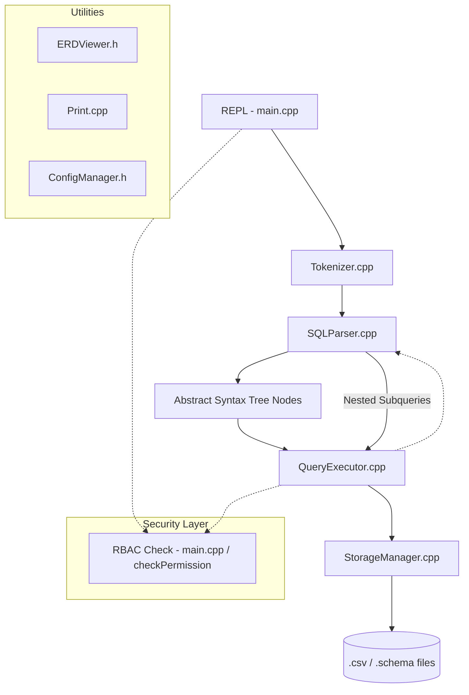

# FeatherDB Internal Documentation

FeatherDB is a file-based relational database engine implemented in C++ (version `1.2.1-FIXED-SECURITY`). It is designed as a pedagogical tool to demonstrate the core principles of SQL parsing, query execution, and relational data persistence.

---

## 1. SYSTEM OVERVIEW

### Scope and Goals
FeatherDB provides a functional SQL environment for:
- Defining schemas with `PRIMARY KEY`, `UNIQUE`, and `REFERENCES` constraints.
- Performing `SELECT`, `INSERT`, `UPDATE`, `DELETE`, and `DROP` operations.
- Managing role-based access control (RBAC) via secret keys.
- Visualizing entity relationships dynamically.

### Non-Goals
FeatherDB is **not** intended for:
- High-concurrency or multi-user production environments.
- Large-scale data processing (requires RAM-sized table residency).
- ACID-compliant transaction management with crash recovery logs.

---

## 2. ARCHITECTURE DIAGRAM

The following diagram illustrates the unidirectional pipeline from user input to disk storage:

---

## 3. COMPONENT DEEP DIVES

### **Tokenizer**
- **Location**: `src/parser/Tokenizer.h/cpp`
- **Responsibility**: Converts raw string input into a stream of atomic tokens.
- **Interface**: `std::string nextToken()`, `bool hasNext()`, `TokenType getLastTokenType()`.
- **Internal State**: `position` pointer, `currentToken`, and its `TokenType`.
- **Modding Impact**: Changing delimiters or adding keywords (e.g., `JOIN`) here requires corresponding updates in the Parser.

### **SQLParser**
- **Location**: `src/parser/SQLParser.h/cpp`
- **Responsibility**: Uses recursive descent to validate syntax and construct an AST.
- **Interface**: `std::unique_ptr<AST> parse()`.
- **Internal State**: Reference to `Tokenizer`, `currentToken`, and `currentType`.
- **Modding Impact**: Changing the grammar (e.g., optional `FROM` clause) breaks the SQL dialect and requires `QueryExecutor` adjustments.

### **Abstract Syntax Tree (AST)**
- **Location**: `src/parser/AST.h/cpp`
- **Responsibility**: Provides a polymorphic data structure to represent SQL statements.
- **Interface**: `virtual std::string toString()`. Subclasses: `SelectStatement`, `InsertStatement`, etc.
- **Modding Impact**: Adding fields here (e.g., `GROUP BY` column) requires updates in both Parser (to fill it) and Executor (to process it).

### **QueryExecutor**
- **Location**: `src/query/QueryExecutor.h/cpp`
- **Responsibility**: Processes AST nodes and performs logical operations (Filtering, Sorting, Integrity Checks).
- **Interface**: `void execute(std::unique_ptr<AST>, std::string& currentRole)`.
- **Internal State**: Stateless execution handler; uses `Table` structs for in-memory processing.
- **Modding Impact**: Modifying `evaluateSimple` affects logic for `WHERE`, `UPDATE`, and `DELETE` clauses.

### **StorageManager**
- **Location**: `src/storage/StorageManager.h/cpp`
- **Responsibility**: Manages physical I/O for schemas, data rows, and RBAC metadata.
- **Interface**: `static Table loadTable()`, `static bool saveTable()`, `static bool appendRow()`.
- **Internal State**: Static methods operating directly on the file system (`db/` directory).
- **Modding Impact**: Changing the CSV format (e.g., to JSON) requires a complete rewrite of `loadTable` and `saveTable`.

### **RBAC / Security Layer**
- **Location**: `main.cpp` (Auth logic) & `StorageManager.cpp` (Permission checks).
- **Responsibility**: Intercepts queries to check role permissions before execution.
- **Interface**: `checkPermission(role, action, table)`, `getRoleBySecret(secret)`.
- **Modding Impact**: Disabling the `currentRole.empty()` check in `main.cpp` reveals all data to unauthenticated users.

### **Utils (ERD & Print)**
- **Location**: `src/utils/`
- **Responsibility**: UI helpers and relationship visualization.
- **Interface**: `ERDViewer::printERD()`, `printPrompt()`, `ConfigManager`.

---

## 4. DATA FLOW TRACES

### **SELECT with WHERE and Subquery**
1. `SQLParser` identifies the `WHERE` clause and detects a nested `(` in `parseSelect()`.
2. `SQLParser::parse()` is called recursively to create a sub-AST.
3. `QueryExecutor::executeSelect()` executes the sub-AST first.
4. The resulting `Table` is expected to have 1 row and 1 column; the value is extracted.
5. The string value is injected back into the outer query's `condition` string.
6. The outer query then filters rows using `evaluateSimple` based on the resolved condition.

### **INSERT with FK and UNIQUE Validation**
1. `QueryExecutor::handleInsert()` identifies columns marked as `UNIQUE` or `PRIMARY KEY` in the table schema.
2. It calls `StorageManager::loadTable()` to scan existing rows for duplicate values.
3. If a column has an `fkTargetTable`, the executor loads the target table schema and checks if the inserted value exists in the target's Primary Key column.
4. If all checks pass, `appendRow()` is called to write the record to disk.

### **DELETE with Referential Integrity (RESTRICT)**
1. `QueryExecutor::handleDelete()` identifies if the table being deleted from is a parent table (referenced by others).
2. It iterates through all rows matching the `WHERE` clause.
3. For each matching row, it calls `hasDependentRows()`, which scans *every other table* in the `db/` folder to see if any child table holds a reference to this row's Primary Key.
4. If a dependency is found, the entire operation is aborted with a `RESTRICT` error.

---

## 5. STORAGE FORMAT SPECIFICATION

### **.schema Files**
- **Format**: Space-separated fields per column.
- **Syntax**: `column_name column_type [PK] [FK target_table] [UNIQUE]`
- **Example**: `trainer_id INT PK UNIQUE REFERENCES trainer`

### **.csv Data Files**
- **Format**: Comma-separated values (CSV).
- **Trimming**: The `StorageManager` automatically trims whitespace from values during `loadTable`.

### **RBAC Metadata**
- **`db/_roles.csv`**: `role_name,secret_key`
- **`db/_permissions.csv`**: `role_name,action,table_name`

---

## 6. SQL DIALECT REFERENCE

- **CREATE TABLE**: `CREATE TABLE <name> (<col> <type> [PK] [UNIQUE] [REFERENCES <table>], ...);`
- **INSERT**: `INSERT INTO <name> (<cols...>) VALUES (<vals...>);`
- **SELECT**: `SELECT <cols...> /* FROM (SELECT...) OR <table> WHERE <cond> ORDER BY <col>;`
- **UPDATE**: `UPDATE <table> SET <col> = <val> WHERE <cond>;`
- **DELETE**: `DELETE FROM <table> WHERE <cond>;`
- **DROP**: `DROP TABLE <name>;`
- **GRANT**: `GRANT <priv, ...> ON <table> TO <role>;`
- **CREATE ROLE**: `CREATE ROLE <role> WITH SECRET '<key>';`

---

## 7. RELATIONSHIP & ERD SYSTEM

FeatherDB dynamically detects relationships by scanning `.schema` files:
- **1:1**: Detected when a column has a `REFERENCES` constraint **AND** is also `UNIQUE` or a `PRIMARY KEY`.
- **1:N**: Detected when a column has a `REFERENCES` constraint but is not unique.
- **N:N**: Detected when *all* columns in a table are `REFERENCES` (i.e., a pure junction table).

The `.erd` command iterates through all tables and applies this logic to render a relationship matrix.

---

## 8. OOP & DESIGN PRINCIPLES

### **SOLID Analysis**
- **Single Responsibility**: `Tokenizer` only lexes, `Parser` only builds AST, `StorageManager` only handles files.
- **Open/Closed**: The `AST` base class allows adding new statements (like `DROP`) without modifying existing ones.
- **Liskov Substitution**: `QueryExecutor` treats all `AST` subclasses polymorphically via the `execute()` method.
- **Interface Segregation**: `StorageManager` provides granular static methods instead of a monolithic data object.
- **Dependency Inversion**: `QueryExecutor` depends on the abstract `AST` class, not concrete statement implementations.

### **Simplified Design Decisions**
- **Static Storage**: `StorageManager` uses static methods instead of a singleton or injected instance to simplify table loading across components.
- **String-Based Internal Logic**: All data is initially treated as strings and converted to `int` only during evaluation to support CSV naturally.

---

## 9. KNOWN BUGS & LIMITATIONS

- **Memory**: Tables must fit entirely in RAM. No paging/buffer pool.
- **Concurrency**: No locking mechanism; concurrent writes will lead to data corruption.
- **Strings**: Multi-word string support requires single quotes (e.g., `'Ash Ketchum'`). 
- **Subqueries**: `SELECT` in `WHERE` only supports scalar (single value) returns.
- **Recursion**: Deeply nested subqueries may hit stack limits in the recursive descent parser.
